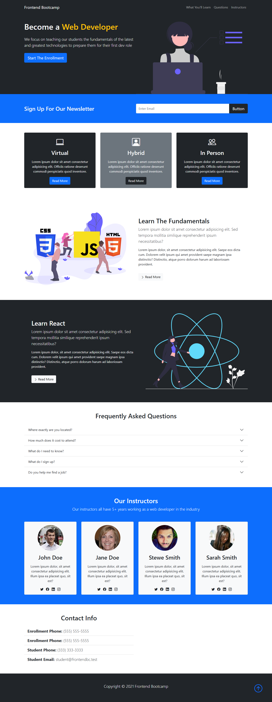

# 🌐 Small Clones

A curated collection of small front-end clone projects built with **HTML, CSS, and Bootstrap** for learning and practice.  
These projects focus on replicating the **layout and structure** of real-world websites, serving as exercises in front-end development.

---

## 🎯 Purpose
The goal of this repository is to improve front-end skills by building simple, static website clones.  
These are **not functional replicas**, but rather visual and structural implementations.

---

## 📁 Projects

### 1. Bootstrap 5 Crash Course
- **Folder:** `Bootstrap-5-Crash-Course`
- **Technologies:** HTML, CSS, Bootstrap
- **Description:** A static landing page built during a crash course.
- **Screenshot:**  
  

---

## 🛠 Technologies Used


---

## 🚀 How to Run a Project

There are two ways to run a project:

### Option 1 – Clone the entire repository
```bash
git clone https://github.com/username/small-clones.git
cd small-clones/Bootstrap-5-Crash-Course
open index.html
```

### Option 2 – Download only one project

- Navigate to the project folder in GitHub (for example: Bootstrap-5-Crash-Course).
- Click the Code button and select Download ZIP.
- Extract the folder on your computer.
- Open index.html in your browser.